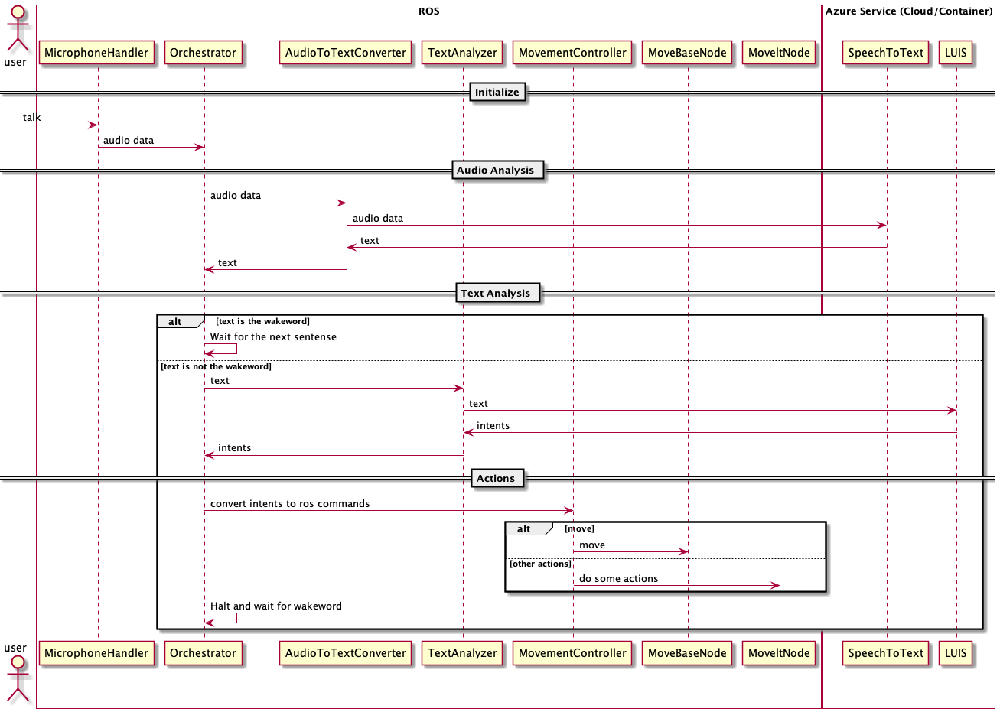

# Architect Design

This ROS application bridges between ROS and the Azure Language Understanding Service. The ROS node can be configured to process audio directly from a microphone, or can subscribe to a ROS audio topic, then processes speech and generates "intent" ROS messages which can be processed by another ROS node to generate ROS commands.

## End To End Scenario

As shown in the following diagram, user talks to the device, the audio is captured by microphone and passed to the orchestrator. The orchestrator passes the audio to AudioToTextConverter node which connects to Azure Speech To Text Service to convert the audio to texts. Once the orchestrator receives the audio content, if the content is the wakeword, then the orchestrator begins to accept command from the user; if the content is the command, the orchestrator leverages the TextAnalyzer node which connects to LUIS to understand the command and get the intents. After that, the orchestrator uses the MovementController node to generate the movement commands and ask the device to act on the commands. Finally, the orchestrator halts and wait for the wakeword again.

## Basic ROS Concepts
These concepts are implemented in the ros_comm repository.

- Nodes: Nodes are processes that perform computation. ROS is designed to be modular at a fine-grained scale; a robot control system usually comprises many nodes. For example, one node controls a laser range-finder, one node controls the wheel motors, one node performs localization, one node performs path planning, one Node provides a graphical view of the system, and so on. A ROS node is written with the use of a ROS client library, such as roscpp or rospy.

- Master: The ROS Master provides name registration and lookup to the rest of the Computation Graph. Without the Master, nodes would not be able to find each other, exchange messages, or invoke services.

- Parameter Server: The Parameter Server allows data to be stored by key in a central location. It is currently part of the Master.

- Messages: Nodes communicate with each other by passing messages. A message is simply a data structure, comprising typed fields. Standard primitive types (integer, floating point, boolean, etc.) are supported, as are arrays of primitive types. Messages can include arbitrarily nested structures and arrays (much like C structs).

- Topics: Messages are routed via a transport system with publish / subscribe semantics. A node sends out a message by publishing it to a given topic. The topic is a name that is used to identify the content of the message. A node that is interested in a certain kind of data will subscribe to the appropriate topic. There may be multiple concurrent publishers and subscribers for a single topic, and a single node may publish and/or subscribe to multiple topics. In general, publishers and subscribers are not aware of each others' existence. The idea is to decouple the production of information from its consumption. Logically, one can think of a topic as a strongly typed message bus. Each bus has a name, and anyone can connect to the bus to send or receive messages as long as they are the right type.

- Services: The publish / subscribe model is a very flexible communication paradigm, but its many-to-many, one-way transport is not appropriate for request / reply interactions, which are often required in a distributed system. Request / reply is done via services, which are defined by a pair of message structures: one for the request and one for the reply. A providing node offers a service under a name and a client uses the service by sending the request message and awaiting the reply. ROS client libraries generally present this interaction to the programmer as if it were a remote procedure call.

- Bags: Bags are a format for saving and playing back ROS message data. Bags are an important mechanism for storing data, such as sensor data, that can be difficult to collect but is necessary for developing and testing algorithms.

## Components

AudioToTextConverter, TextAnalyzer and MovementController are all Services since they need to communicate with the orchestrator. The orchestrator could be a node or a service depends on the design of the audio feed. If the microphone stores the audio in Topics, then the orchestrator could be a node which consumes the audio data from the topic, otherwise, the orchestrator should be a service that receives audio data from the microphone.